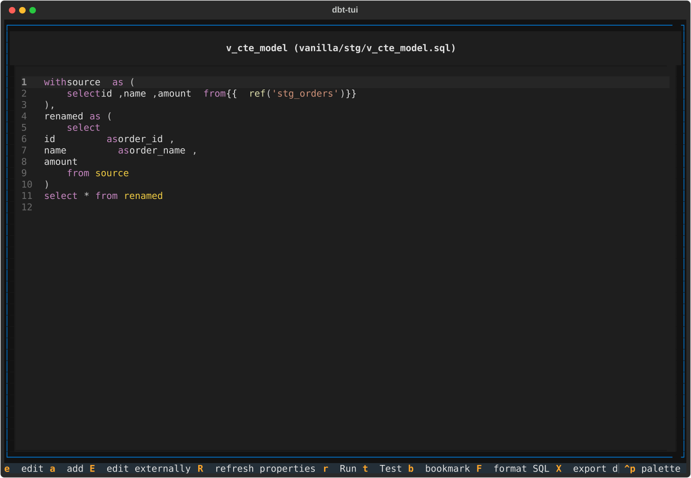

# dbt-tui

A terminal UI for exploring, navigating, and managing dbt projects.



## Features

### Model Exploration
- Fuzzy model search with entity type filters (Models/Macros)
- Tag and materialization filters
- Full-text property viewer with live filtering
- Recently visited models (history)
- Bookmark/favorite models for quick access

### Visualization & Navigation
- ASCII DAG visualization with adjustable depth and keyboard navigation
- Mermaid export for DAG diagrams
- Column-level lineage via sqlglot (CTE-aware and JOIN-aware)
- Parent/child model relationships
- `source()` parsing and graph integration

### Model Details
- Tabbed view: Properties, Docs, Git, Run, Tests, Compile
- Markdown documentation rendering from schema.yml
- Git integration: file status, commit log, blame
- dbt compile preview
- SQL syntax highlighting

### dbt Operations
- Run/test/build with streaming output
- Run history navigation
- Inline dbt test results with pass/fail status per test
- Schema.yml editor modal (edit descriptions and tags)

### Workspace & Persistence
- Multi-project workspace with tab bar
- Session persistence (last project, model, bookmarks, workspaces)
- External editor integration
- Keyboard shortcut help screen

## Installation

### From PyPI

```bash
pip install dbt-tui
```

### From Source

```bash
git clone https://github.com/mikely-97/dbtui.git
cd dbtui
pip install -e ".[dev]"
```

### Requirements

- Python 3.12 or higher
- A dbt project to explore

## Quick Start

```bash
dbt-tui
```

On first launch, dbt-tui will:
1. Auto-detect dbt projects in the current directory and parent directories
2. Open the most recently viewed project (if available)
3. Display the model search screen

Navigate with keyboard. Press `?` for the complete help screen.

## Key Bindings

### Global

| Key | Action |
|-----|--------|
| `q` | Quit |
| `o` | Options |
| `f` | Find model |
| `p` | Change project |
| `g` | Recent models |
| `v` | Property viewer |
| `d` | DAG view |
| `l` | Column lineage |
| `B` | Bookmarks |
| `?` | Help screen |

### Model View

| Key | Action |
|-----|--------|
| `r` | Run model |
| `t` | Test model |
| `R` | Refresh properties |
| `E` | Open in external editor |
| `e` | Edit schema.yml |
| `b` | Toggle bookmark |
| `Tab` | Next pane |
| `Enter` | Enter edit mode (SQL editor) |
| `Escape` | Exit edit mode / save |

### DAG View

| Key | Action |
|-----|--------|
| `+` | Increase depth |
| `-` | Decrease depth |
| `m` | Mermaid export |
| `Enter` | Navigate to selected node |
| `Escape` | Back |

### Model Search

| Key | Action |
|-----|--------|
| `↑/k` | Previous result |
| `↓/j` | Next result |
| `Enter` | Select model |
| `Escape` | Back |

## Configuration

dbt-tui stores settings in your platform's config directory (via `platformdirs`):

- **Cache & bookmarks**: Model history and favorite models
- **Session state**: Last viewed project and model
- **External editor**: Configure in options screen (`o`)

## Development

### Running Tests

```bash
pytest
```

### Linting

```bash
ruff check src/ tests/
ruff format src/ tests/
```

### Test Project

The `tests/testing/` directory contains a sample dbt project with various model configurations, macros, and schema definitions for testing purposes.

## Architecture

dbt-tui is organized into three main layers:

- **Backend** (`dbt_tui/backend/`): Core dbt project parsing, model introspection, property discovery
- **Frontend** (`dbt_tui/frontend/`): Textual-based screens, keyboard input, UI state management
- **Common** (`dbt_tui/common/`): Shared abstractions and utilities

Key classes:
- `DbtProject`: Loads and parses dbt projects
- `DbtModel`: Represents a single model with full introspection
- `PropertyClaim`: Unified representation of properties from any source (dbt_project.yml, schema.yml, model config)

## License

MIT

## Acknowledgments

dbt-tui is built on:
- [Textual](https://textual.textualize.io/) - Rich terminal UIs in Python
- [sqlglot](https://sqlglot.com/) - SQL parser and compiler
- [NetworkX](https://networkx.org/) - Graph algorithms
- [ruamel.yaml](https://yaml.readthedocs.io/) - YAML serialization
- [watchdog](https://github.com/gorakhargosh/watchdog) - File system monitoring
